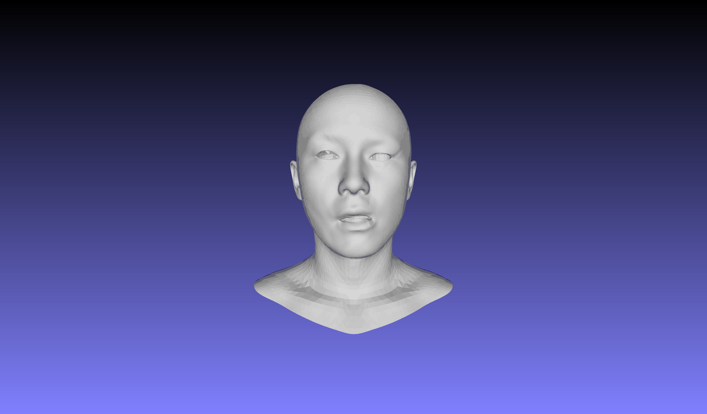

# ASM-unofficial
论文 "ASM: Adaptive Skinning Model for High-Quality 3D Face Modeling" 的非官方实现.

## 如何运行
0. 配置运行环境: 当前项目依赖 pytorch=2.0, pytorch3d=0.7, pytorch_lightning=2.0 三个库, 可以使用 pip 或 conda 自行安装(推荐使用conda)
1. 下载 HIFI3D++ 三维人脸数据集, 命名为 "hifi3dpp.mat", 放到 data 文件夹中
2. (可选) 运行 `python src/tools/init_gmm_params.py` 获取 Blender 初始蒙皮权重对应的二维正态分布参数, 将会在 data 文件夹中生成对应的参数文件 `inited_gmm_params_K*.pkl` 
3. 运行 `python src/train.py` 拟合添加随机特定表情的人脸形状, 拟合好的 Mesh 文件将会保存为 `data/output/optimized.obj`

可视化拟合过程: 

## data 文件夹中的部分数据说明

### mu_face.obj

HIFI3D++ 人脸数据集的平均脸形状

### face_rig.blend

将 mu_face 导入到 Blender 后, 使用 Rigify 手动绑定, 自动生成权重.
* 绑定的人脸面部骨骼相关的数据保存在 `data/rig_info.json` 文件中
* 自动分配的权重数据保存在 `data/weights_map.pkl` 文件中

保存数据的代码在 face_rig.blend 文件中, 可在 scripts 选项卡中修改

### weights_map.json

蒙皮权重存储为一个 python 字典, 格式如下所示:
~~~python
{
  "<bone_name_1>" : {
    "vertex_indices": np.array(some_value), # i-th element represents i-th vertex of mesh is(True) or not(False) weighted by this bone named bone_name_1
    "weights": np.array(some_value) # i-th element represents the weight of this bone on the i-th vertex 
  },
  "<bone_name_2>" : {
    "vertex_indices": np.array(some_value),
    "weights": np.array(some_value)
  }
  # ... other bones' weights
}
~~~

## 相对于原论文的一些实现上的修改
* 所有面部骨骼的父骨骼都改成了头部根骨骼(在头部内部中心), 目的是为了降低骨骼级联的层数, 可以并行计算所有的面部骨骼的变化, 提高运行效率, 同时也使得参数更容易优化
* 优化过程中计算 $\zeta_j$ 的重心坐标时, 使用与其最近的三角形(使用三角形的重心判断), 避免 $\zeta_j$ 落入 UV 空间中可能存在未覆盖到三角形的区域时无法计算重心坐标的问题
* 约束 $\sum_{k=1}^K \pi_k=1$ 和 $\sum_{j=1}^J w_j^g =1$ 使用了类似 `softmax` 的自定义的 `softweight` 函数.